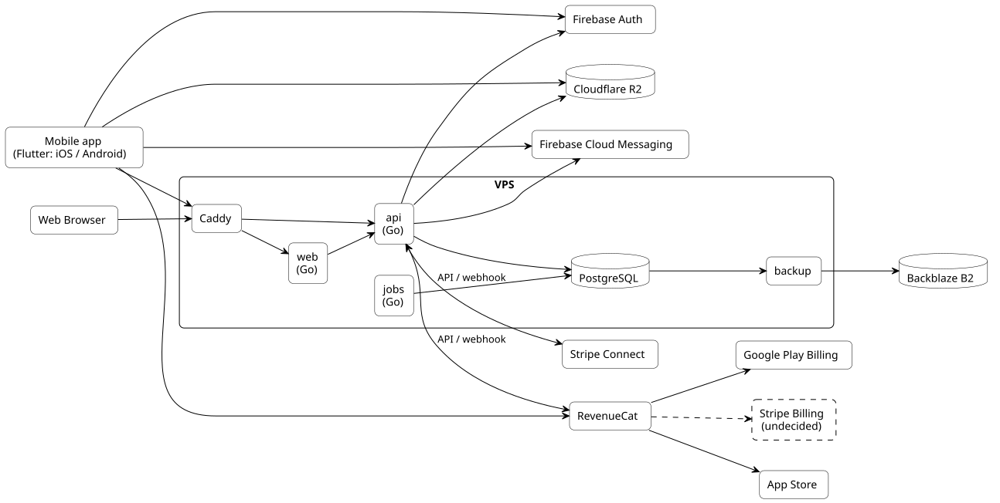

# 技術要素

使う技術と外部サービス、それを選んだ理由を記述する。具体的な設計は記述しない。

## 構成

元ファイルは[system.puml](diagrams/system.puml)。

## 使う技術

| 要素 | 技術 | 選んだ理由 |
|---|---|---|
| モバイルアプリ | Flutter (iOS、Android) | エコシステムが成熟していて、Firebaseとの連携が公式に提供されている |
| Web | Go | 公開ページ (利用規約、プライバシーポリシー、Stripe Connectの戻り先) だけを持つ。Webアプリにすると、レフェリーがAIやbotでないことを担保しにくい |
| API | Go | シンプルで、単一のバイナリにでき、コンテナと相性がよい |
| 定期処理 | Go、Supercronic | 処理はGoに集め、起動の時刻だけを外に出せる |
| データベース | PostgreSQL | 信頼性が高く、SQLの機能が揃い、OSSで持ち運べる |
| スキーマの管理 | Atlas | 宣言的に管理でき、変更を再現・レビューしやすい |
| 実行環境 | VPS、Docker Compose | ローカルと同じ構成で動き、一人で運用できる |
| リバースプロキシ | Caddy | HTTPSの証明書を自動で更新でき、設定がシンプル |
| 認証 | Firebase Authentication | Flutterから使いやすく、発行されたトークンをAPIで検証できる |
| プッシュ通知 | Firebase Cloud Messaging | iOSとAndroidの両方に通知を送れる |
| ファイルの保存 | Cloudflare R2 | S3互換で安い。アプリはAPIが発行した署名付きURLで直接アップロードし、鍵はアプリに渡さない |
| バックアップ | Backblaze B2 | 安く、データベースと別の事業者に置ける |
| 課金 | RevenueCat、Google Play Billing、App Store | 2つのストアの購読の状態を、1つの仕組みで扱える |
| レフェリーへの支払い | Stripe Connect | 個人への送金と、本人確認を任せられる |

## 決めていないこと

- お金の受け取り方。サブスクリプションか、都度払いか。都度払いならStripe Billingを使う。[お金を預からない](overview.md#お金を預からない)ので、レビューが終わったときに引き落とす形にする必要がある
- お金の受け取り方に応じた、ストアの規約の確認
